# Foods R Us : 
An E-Commerce grocery shopping Website built using Java Servlet programming and Rest Web services
Submitted as the final project for the course **EECS4413-Building E-Commerce Systems** taught by Prof Hamzeh Roumani at york University

# Foods R Us : An E-Commerce Website
> Submitted as the final project for the course **EECS4413-Building E-Commerce Systems** taught by Prof Hamzeh Roumani at york University

## Table of Contents
* [Technologies Used](#technologies-used)
* [Screenshots](#screenshots)
* [Deployment](#deployment)
* [Design](#design)
* [Implementation](#implementation)
* [Project Status](#project-status)
* [Acknowledgements](#acknowledgements)

## Technologies Used
- Java EE
- Servlets
- Apache TomCat
- Maven
- SQl
- Bootstrap 4
- CSS
- HTML

## Screenshots
#### Main Page
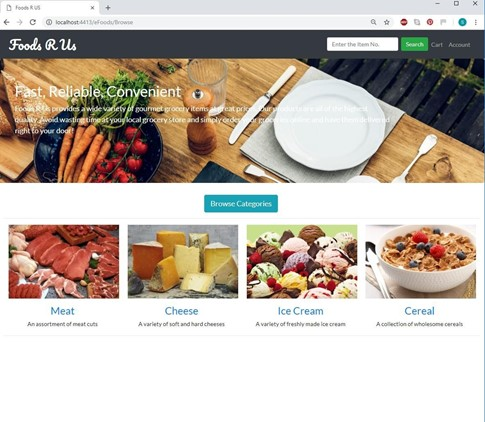

#### Listing of items, with the option to sort available
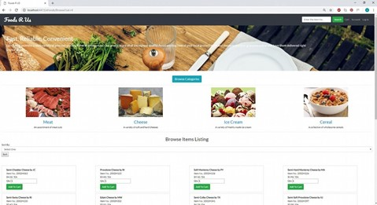

#### Prior to Log in, the Log in link will be provided
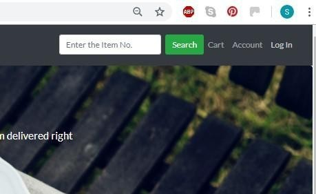

#### The login Redirected view
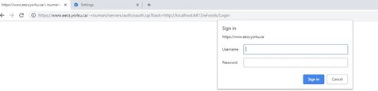

#### After the login, the login link will disappear
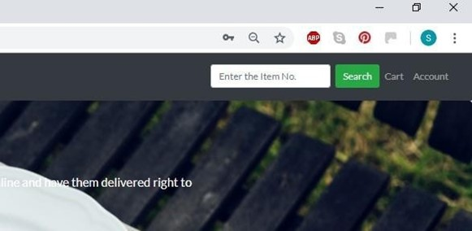

#### The Cart View
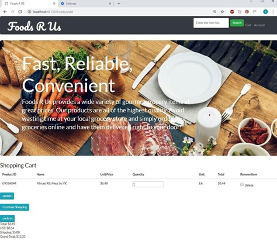

#### The view after a checkout was successful
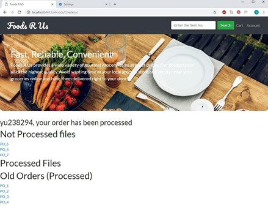

#### The Appearance of advertised item when End-user add into cart item number 1409S4
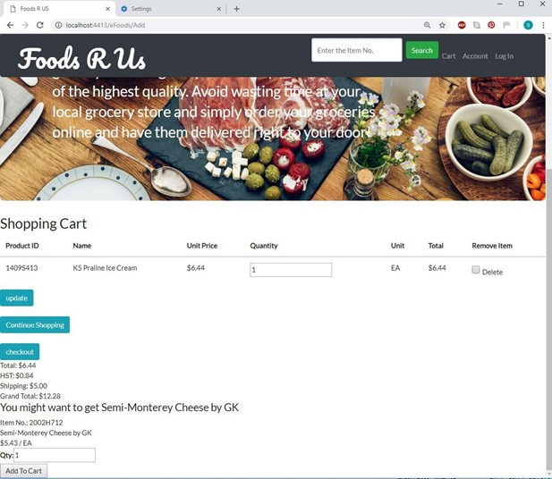

#### Purchase order view
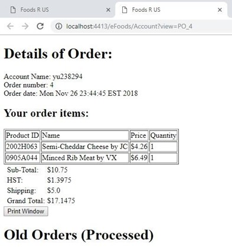

#### The page for admin to view analytics report
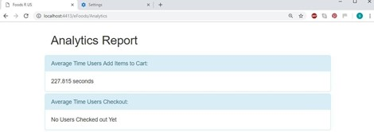

## Deployment
To open this webapp, use Eclipse IDE for Java EE Developers.
Right-click on the project and select "Run As / Run on Server" in the shortcut menu.
Alternatively export a `.war`-file and deploy it to your tomcat server.

## Design
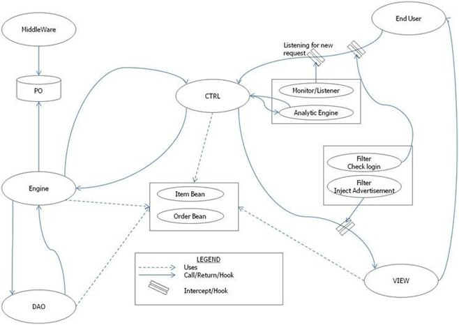
From the diagram above we can conclude the following:
-   Engine acts as the model which is in charge of making sure that users have the data that they     requested. To do this, the Engine communicates with the database using the DAO design            pattern.
-	When a user makes a purchase order, an XML file is generated and stored in folder structure      denoted above as PO
-	End users can contact the controller. However, there are filters and listeners which keep        track of user usage and make sure that users can only access some of the services if they are     authorized
-	The application uses the MVC design pattern.
-	We used JSPX to serve the view to the user. To make the view pretty, we utilized bootstrap

## Implementation
#### Retrieving the Catalog information
- As part of the DAO design pattern, we decided to create a bean class to represent a Catalog object, as a mean to pass catalog data to the view. 
- This will facilitate the passing of catalogs information from the engine to the controller and to the view. 
- It will be neat and easier for view to handle a Java bean object as well. The bean for each catalog will also contain information pertaining each catalog.
- The common name ‘agreed’ by the controller and the view on retrieving the list of available catalogues is ‘catalogues'.

#### Allowing End-user to view list of items by Category Option
- To request browsing items of a category, we decided to supply a link for the requested category, with the parameter value of the respective category coded on the link on the view itself.
- The number of the catalogue is obtained from the database; hence it will always be the updated one. We will avoid to error such as unavailable or unknown/unrecognized category.

#### Role of the Browse controller
The Browse controller will determine if the request is for:
-	main page’ or ‘fresh request’ to view category list
-	viewing items of a category
-	viewing item with identified item number
-	It will ‘contact’ the engine to supply

#### Role of ItemDAO
For the engine to access the items of a category, we have provided the ItemDAO as an interface to access the database. ItemDAO is a singleton class, whose services will be available to Engine. The main service it provides is returning:
-	List of items (ItemBean) base on the category id requested
-	List of all available categories (CatalogBean)
-	Search and Return an item (ItemBean) base on item number requested.

Note: The entry of the item number has to be exactly the same as that in database, including case sensitivity. It will also pass any error message from the Engine as attribute ‘error’.

#### Role of Engine for the Browsing Service
The Engine will engage ItemDAO to retrieve:
-	List of available Catalogues
-	List of Items to display based on requested catalogue id.
-	Search Item based on item number (which it will return to controller as a list of item, to       make it consistent for display of items).
-	The engine will also pass the error message should it fail to retrieve information from          ItemDAO.

#### Implementing the Service of Maintaining Shopping Cart
-   We have decided to use java object OrderBean as a mean to pass information of the End- User’s     Shopping Cart throughout the session. We have decided to name the attribute ‘order’, though     it does not link well to mean Shopping Cart. However, it meant that it is in the form of java     object OrderBean and it is in fact an open order.
-   We decided not to create another bean for shopping cart since the attributes of a shopping       cart will also be the same as that of an order.
-   The use of order will also make it easy to update the open order/shopping cart, since it has     all the relevant attributes as the total price, shipping cost etc.
-   The updating/calculating of the open order is done by the Engine. The ctrl Add will identify     if it is a request to add additional item, or updating the cart/order. It will then call on     the Engine, pass to the engine the OrderBean of the End-user, to process the adding of the        selected item, or updating the cart/order.

#### Issues to consider when adding item:
- We have initially omit the handling of negative entry of quantity. This is caught when we are     testing our webapp.
-   The engine will need to check if the item added, is already in the cart. If it is, it will       just increment the quantity in the new added request.

#### Issues to consider when updating cart/order:
We found updating the cart actually requires more tact than adding item to the order/cart.
-	First we need to identify if it is a request to delete a row item.
-	Second we need to find out if there is any changes in the quantity. We decide, whenever there     is a request to update the cart, the ctrl Add will:
-	Create a toDelete List, and check if there is item(s) to be deleted. We make the Engine         accept zero length list.
-	Create the item list to get the items already in the cart and the quantity passed through        the update request.
-   The Engine will then just update accordingly. We have created a separate helper method to        delete item from cart, and to update quantity. We also create helper method to calculate the     updated cost.

#### Implementing the Service of Login
- To implement the required login for service of ‘Check Out’ or viewing ‘My Account’, we decided to implement to a filter. The filter will check for “Check Out” and “Account” service requests, and will divert to our Login servlet to direct End-User to login if they are not logged in.

#### Implementing the Service of Analytics
-   The service of Analytics is accessible via the address: http://localhost:4413/eFoods/ Analytics
-   We decided to package the analytics component into one package, consist of the listener to       get and accumulate data for the analytics, the engine that will compute the requested            analytics information, and to facilitate easier recording of the required analytics, 
-   we created a bean to track a user’s activity throughout its session. Using this method, we do     not need to create multiple attributes to store different kind of data: such as an attribute     for list of checkout time, an attribute for list of adding item. We decide to create an entry     per user, store it in a bean-like object UserActivity. 
-   The Servlet Context will have an attribute to store the information of each user. When           computing the analytics data, we can just iterate through each user data to get the number.

#### Implementing the filter for Ad Hoc Advertisement
-   Since we are supposed not to make any changes to the servlet, we fixed in a hook on Add servlet, before it gets to the servlet. It will check if it is a request to add the ‘hooked’ item. If yes, we will poke in the advertise item to the request, which will get printed on the ‘advertised’ division.

#### Implementing the Middleware
-   To facilitate for platform independence, the main location of the PO (which is the main directory of the webapp) will be read as the main’s arguments. 
-   The subdirectory where the PO is located is assumed to be known to the middleware I.e (WEBCONTENT/PO). The middleware will then iterate through the PO. For each PO xml file, 
-   it will extract the items and corresponding quantity listed in the PO, and after processing that, moved the PO into the ‘processed PO’ folder. 
-   This process though, has to been ‘priorly agreed’ between the webapp and the middleware, as the webapp will need to iterated between two folders when showing users their PO link.

#### A client checks out
-   Whenever a client presses the checkout button, a listener ensures that the client is logged in. If the client is not logged in, the listener will redirect the client to the login page. When the client successfully logs in, the client will be redirected to the checkout page again. The client will have to click on the confirm button to finish the purchase order.
- At this point, the client’s request will be redirected to the checkout controller. The checkout controller retrieves the order bean of the client from the session. Using the order bean, an XML file is created and stored under the unprocessed XML folder created dynamically whenever the server starts if it does not exist

#### A client visits the URL of a P/O
-   When the client visits the account or the checkout controller, the client will see all the processed and unprocessed Purchase Orders associated with this client. 
-   When a request comes into the “Account” controller with a the parameter “view”, the controller will call a method in the engine. This method will look under processed purchase order folder and the unprocessed purchase order folder. 
-   If the file is found with the same name as was provided in the view parameter, this file is converted into the order bean object. This bean is served to the user through a jspx file

#### The account controller
The account controller displays all the processed and unprocessed PO associated with the user. The implementation of this service is as follows. 
-   The code will iterate through the files under “PO” folder and “Unprocessed_PO“ folder. 
-   Each file is converted into an order bean. 
-   From the order bean, user name is extracted. If the user name matches the user name in the       session, the name and the path of this bean will be visible to the user

## Acknowledgements

- This project was inspired by Professor Hamzeh Roumani 
- This project was based on a final project submission for course EECS4413 E-Commerce Systems at York University

